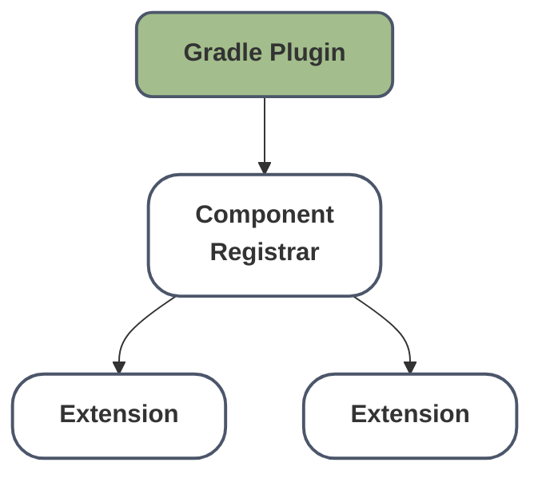

# Compiler Plugin

Tracy uses a **Kotlin Compiler Plugin (KCP)** to power its annotation-based tracing. This section explains how the plugin works and provides background on the Kotlin compiler architecture.

!!! tip "Related: Usage Guide"
    For documentation on using the `@Trace` annotation in your code, see [Function Tracing with Annotations](../tracing/annotations.md). This section covers the technical implementation details of the compiler plugin.

## What is a Kotlin Compiler Plugin?

A Kotlin Compiler Plugin is a program that "hooks" into the Kotlin compiler pipeline to change or extend its behavior. Plugins typically work directly with Kotlin's **Intermediate Representation (IR)** to transform code at compile time.

### Examples of Compiler Plugins

The Kotlin ecosystem includes several well-known compiler [plugins](https://github.com/JetBrains/kotlin/tree/master/plugins):

- **`noarg`**: Automatically generates a no-argument constructor for classes
- **`allopen`**: Automatically makes classes and their members `open`
- **`kotlin-serialization`**: Generates efficient serializers and deserializers for data classes
- **`power-assert`**: Provides detailed assertion failure messages

Tracy's compiler plugin automatically wraps functions annotated with [`@Trace`]({{ api_docs_url }}/tracing/core/ai.jetbrains.tracy.core.instrumentation/-trace/index.html) with tracing logic — no boilerplate required.

## Compiler Plugins vs Annotation Processors

Tracy uses a compiler plugin rather than annotation processors (kapt/KSP) due to the following differences:

|  | Annotation Processors | Compiler Plugins |
|--------|----------------------|------------------|
| **API stability** | Public, documented | Private, undocumented |
| **Code generation** | Emits new source files | Modifies existing bytecode |
| **Code modification** | Cannot modify existing code | Can transform function bodies |
| **Multiplatform** | KSP only (kapt is JVM-only) | All targets (JVM, JS, Native) |
| **Execution phase** | Before compilation | During compilation (IR phase) |

Tracy must wrap existing functions with tracing logic. Annotation processors can only generate new files — they cannot modify the annotated function itself. Compiler plugins operate on IR and can transform any function body directly.

## Plugin Architecture

A Kotlin compiler plugin consists of several components:

### Gradle Plugin

The Gradle plugin integrates with your build system and configures the compiler plugin. Tracy's Gradle plugin (`ai.jetbrains.tracy`) handles version compatibility automatically — since Kotlin compiler plugins must match the Kotlin compiler version, Tracy provides multiple plugin builds (for Kotlin 1.9.x, 2.0.x, 2.1.x, 2.2.x). The Gradle plugin detects your Kotlin version and selects the appropriate compiler plugin artifact.

### Component Registrar

The Component Registrar is the entry point that registers extensions with the Kotlin compiler. Tracy's `TracyPluginRegistrar` implements `CompilerPluginRegistrar` and supports both K1 and K2 compilers.

### Extensions

Extensions are where the actual work happens. Tracy uses `IrGenerationExtension` to transform Kotlin IR. The `TracyGeneratorExtension` visits all functions, finds those annotated with `@Trace`, and wraps their bodies with tracing calls.

## Learn More

- [How Tracy Transforms Code](ir-transformation.md): Deep dive into Tracy's IR transformation logic
