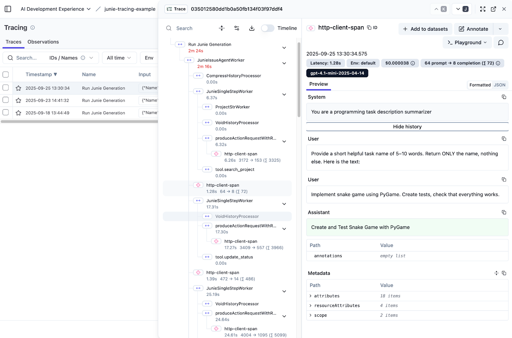

# Supported Backends

OpenTelemetry backends collect, process, and store telemetry data – such as traces, metrics, and logs – providing visualization and analysis to help developers monitor performance, diagnose issues, and optimize systems.

The library supports:

1. [Langfuse](https://langfuse.com/): [`LangfuseExporterConfig`]({{ api_docs_url }}/tracing/core/ai.jetbrains.tracy.core.exporters.otlp/-langfuse-exporter-config/index.html)
2. [W&B Weave](https://wandb.ai/site/weave/): [`WeaveExporterConfig`]({{ api_docs_url }}/tracing/core/ai.jetbrains.tracy.core.exporters.otlp/-weave-exporter-config/index.html)
3. Any other OpenTelemetry-compatible backend (e.g., Jaeger, Prometheus, etc): [`OtlpHttpExporterConfig`]({{ api_docs_url }}/tracing/core/ai.jetbrains.tracy.core.exporters.otlp/-otlp-http-exporter-config/index.html), [`OtlpGrpcExporterConfig`]({{ api_docs_url }}/tracing/core/ai.jetbrains.tracy.core.exporters.otlp/-otlp-grpc-exporter-config/index.html).
4. File: [`FileExporterConfig`]({{ api_docs_url }}/tracing/core/ai.jetbrains.tracy.core.exporters/-file-exporter-config/index.html)
5. Console: [`ConsoleExporterConfig`]({{ api_docs_url }}/tracing/core/ai.jetbrains.tracy.core.exporters/-console-exporter-config/index.html)

_Note: console and file exporters may export in JSON or plain text formats (see [`OutputFormat`]({{ api_docs_url }}/tracing/core/ai.jetbrains.tracy.core.exporters/-output-format/index.html))._

For backend configuration see:

1. [`ai.jetbrains.tracy.core.exporters.otlp.LangfuseExporterConfig`]({{ api_docs_url }}/tracing/core/ai.jetbrains.tracy.core.exporters.otlp/-langfuse-exporter-config/index.html)
2. [`ai.jetbrains.tracy.core.exporters.otlp.WeaveExporterConfig`]({{ api_docs_url }}/tracing/core/ai.jetbrains.tracy.core.exporters.otlp/-weave-exporter-config/index.html)

LLM agent trace on Langfuse:

## Tracing with [Koog](https://docs.koog.ai)

The library can be used together with [Koog](https://docs.koog.ai). The example to be added.